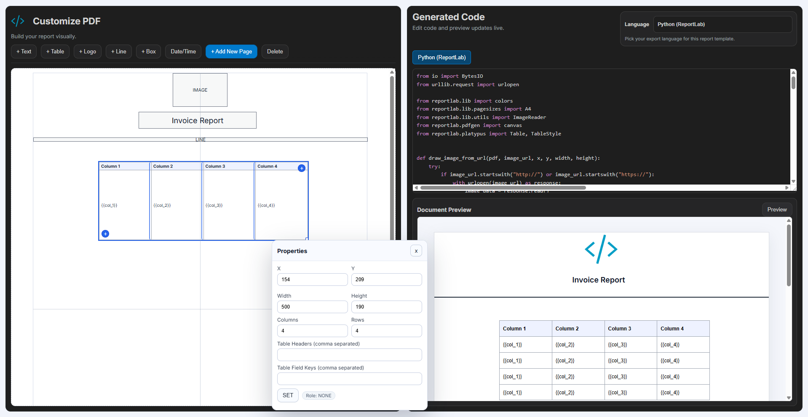

#   Report Builder

Report Builder is a visual drag-and-drop tool for designing multi-page PDF and Excel report templates and instantly generating production-ready code (HTML/CSS, Python ReportLab, OpenPyXL, XML/QWeb, React). Build once, export anywhere, iterate faster.

It gives you a split workspace:

- **Customize Report (left):** drag and configure components on a page canvas
- **Generated Code (right):** live code output in multiple languages



## What This Project Does

The app lets you build report templates visually, then automatically generates equivalent code that you can copy into real projects.

You can create and edit:

- Text blocks
- Images / logos
- Lines and rectangles
- Tables (with headers, field keys, widths)
- Date/Time dynamic field component
- Header and footer repeat elements

It also supports:

- Multi-page canvas
- Page numbering
- Table pagination across pages
- Report Type selector (**PDF** / **Excel**)
- PDF-only **Landscape** toggle with on/off state
- Local state persistence
- Live preview + preview modal
- Dark-themed code editor UI

## Code Outputs

The same visual template is exported to:

- **HTML/CSS**
- **Python (ReportLab , OpenPyXL)**
- **XML (SpreadsheetML, QWeb / Odoo style)**
- **React (XLSX Export, Print)**

This makes the tool useful for different backend/frontend stacks.

## How It Helps a Programmer

This project helps developers by reducing repetitive and error-prone template coding work.

### 1) Faster Development

Instead of manually positioning every element in HTML/XML/Python, you design once in the UI and get code immediately.

### 2) Easier Iteration

You can quickly move, resize, and adjust components visually, then reuse updated generated code.

### 3) Cross-Stack Productivity

One layout can be exported to multiple targets (web, backend PDF, Odoo, React), so you avoid re-implementing the same template several times.

### 4) Better Team Communication

Non-technical stakeholders can review the visual layout while developers work with generated code.

### 5) Cleaner Dynamic Fields

Tokens like table field keys and Date/Time IDs can be mapped from your system data without hardcoding every case by hand.

## Typical Workflow

1. Add and place components in **Customize Report**.
2. Configure properties (size, style, dynamic IDs, table settings).
3. Pick **Report Type** (**PDF** or **Excel**) and output language in **Generated Code**.
4. Copy generated code into your target application.
5. Repeat changes visually when requirements evolve.

## Run Locally

```bash
npm install
npm run dev
```

## Project Goal


Make PDF/Excel report template development visual-first, faster, and easier to maintain for programmers.
